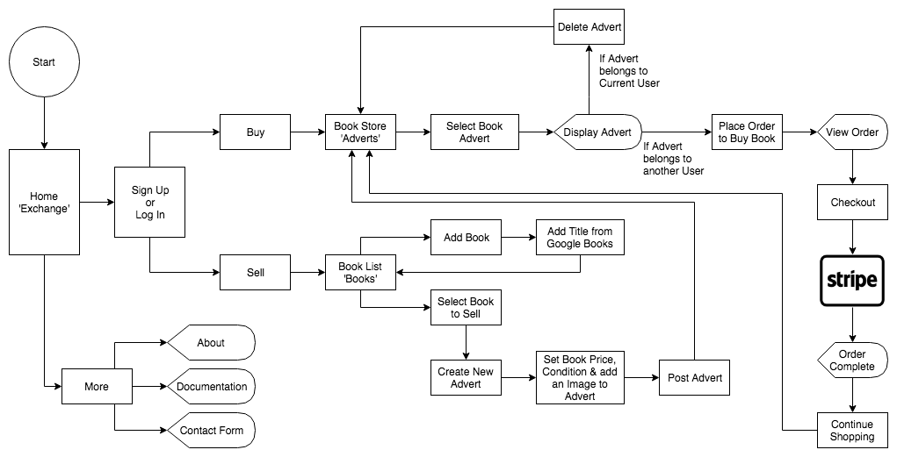
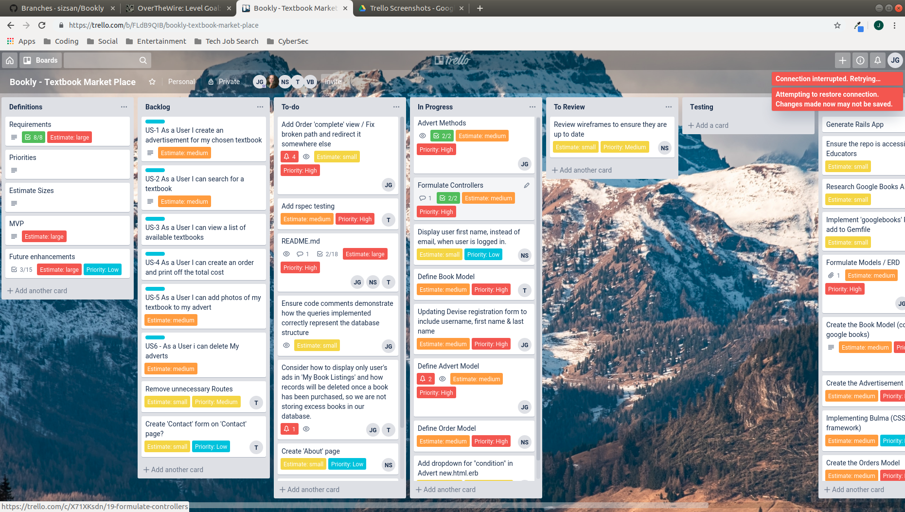

# Bookly

This repository contains the Ruby on Rails assessment (A2-1) for Coder Academy's GenTech program.

Group members:
- Jack Gronow
- Tony Huynh
- Natalie Sargent

### [Bookly App on Heroku](https://b00kly.herokuapp.com/)

### [GitHub Repository](https://github.com/sizsan/Bookly)

## Project Description

### Problem Definition & Purpose
<!-- 1. What is the need (i.e. challenge) that you will be addressing in your project?
2. Identify the problem you’re trying to solve by building this particular marketplace App? Why is it a problem that needs solving? -->
The initial purpose of Bookly arose when the development team observed the lack of localised and dedicated platforms on which students could exchange their textbooks. Many competitors who dominate the marketplace sphere often fail to tailor their products to student needs. The resulting product is often a convoluted and unintuitive website for students. While failing to understand their key demographic and charging disproportionately high fees, a void was created in the marketplace. It was because of this demand for a student-centric textbook marketplace that Bookly was created.

During the development process, the team came to fully grasp the generic and modular nature of the application design. By a unanimous vote, it was decided that the application be tailored to the general public selling books of all kinds.

Starting from its humble beginnings, targeting students, the development team of Bookly eventually recognised that everyone could benefit from a book-specific marketplace that operates on a no/low-fee model. Business models behind the dominating marketplaces have changed over time, many move to subscription-based services while others increase payment fees in order to fund other financial ventures. Whenever this business model shift occurs on an industry-wide level, there is a new drive in demand for simpler alternatives. Bookly fulfills this demand with a no-nonsense book exchange marketplace that does what it does best, provide a platform for those wishing to buy and sell books.

### Functionality & Features
<!-- 3. Describe the project you will be conducting and how your App will address the needs. -->
The driving influence and philosophy behind Bookly is to focus on one purpose and to excel at that purpose. A marketplace on which people can exchange books is simple in design but incredibly difficult to implement with many minor considerations that affect the user experience and overall quality of the product.

Contrasting with generic marketplaces, Bookly focuses on books and allows users to list books for sale or place an order with minimal impediments. A user need not spend more time than necessary in order to list a book as being for sale. Similarly, a user will find very few steps in between logging in to Bookly and placing an order for a book that they have just found. This straightforward implementation resolves any qualms that a user might have in navigating a more convoluted marketplace competitor in achieving the same objective as on Bookly.

### Screenshots


### Tech Stack
- HTML
- Sass / CSS
- Bulma
- JavaScript
- Ruby and eRuby (Embedded Ruby)
- Ruby on Rails
- PostgreSQL
- Heroku

### Instructions to Setup, Configure and Use the App

Installing Ruby:
1. Ensure Ruby is installed by entering the following command in Terminal: `ruby --version`
    - If a valid Ruby version is not returned, refer to the following link to install Ruby for your operating system: https://www.ruby-lang.org/en/downloads/

Installing PostgreSQL:
1. Ensure PostgreSQL is installed by entering the following command in Terminal: `psql --version`
   - If a valid version of PostgreSQL is not returned, refer to the link below to install PostgreSQL for your operating system: https://www.postgresql.org/download/

Downloading the Application:
1. Navigate to the GitHub repository as linked above; and
2. Either **clone** or **download ZIP** of the application.

Installing Gems:
1. Ensure you have **Bundler** installed by opening Terminal and entering the following command:  `bundler --version`
    - If Bundler is not installed and an error is returned, enter the following command to install: `gem install bundler`
2. Navigate to the root directory of the application and install the required gems with: `bundle install`

Database Setup:
1. Bookly's repository contains the default database configuration in `database.example.yml`.
2. Ensure your Terminal's path is in `/Bookly/config` and enter the following command to copy the contents of this default configuration into a separate file to be used by Rails: `cp database.example.yml database.yml`
3. If necessary, change the settings within `database.yml` to match the credentials of your PostgreSQL setup.

Running the Application on your localhost
1. Ensure you are in the application's root directory and enter the following command to run the application within your browser: `rails server`

### Network Infrastructure
<!-- 4. Describe the network infrastructure the App may be based on.
https://devcenter.heroku.com/articles/http-routing 
https://devcenter.heroku.com/articles/dynos
https://www.heroku.com/dynos-->
For this application we used Heroku for our HTTP routing. We chose this cloud service as it handles all of our routing for us through the use of web, worker and one-off dynos. Heroku handles incoming requests by sending them to a load balancer that offers SSL (Secure Socket Layer) termination, from there the request is sent to a router which then determines where the web dynos for the application will be located. Once a web dyno has been selected the router establishes a TCP connection with the dyno then forwards the HTTP request to said dyno. Once the web dyno has received the HTTP request, the request is put into a queue and the web dyno returns a success message to the user. Then a worker dyno picks up the request and runs any process defined in the users procfile that are not defined as 'web'. The worker dynos then return a result and then saves to a database.

### Third Party Software and Services
<!-- 5. Identify and describe the software to be used in your App.
10. Detail any third party services that your App will use.
(20 points) Identify and describe any third party software and services used by your app. 
   - Include services used to deploy your app, to upload content through your app, or to accept payment through your app (10 points)
   - List all gems used and their purpose (10 points) -->

Bookly makes use of several third party software and services for varying purposes.

#### Cloudinary
Cloudinary provides a file upload and storage service whereby users can upload images and videos to a secure cloud storage system. By employing Cloudinary, the development team avoids having to build and maintain any infrastructure.

Databases excel at storing small pieces of data in significant numbers but are not optimised to hold large chunks of data, such as media files. While it is entirely possible to store media files in a local folder when working locally, the files in said local folder cannot be uploaded when services such as Heroku are employed for deployment since they are not designed to store files long term.

In configuring Bookly to integrate with Cloudinary's service, two gems were added to the application which include `cloudinary` and `activestorage-cloudinary-service`. Subsequently, Cloudinary was configured within `storage.yml` where API keys were set. Cloudinary was then set as the upload service of the application in `config/environments/production.rb`.

#### Stripe
Stripe is a complete payments platform that was integrated into Bookly in order to accept payments online via credit card. By using this third party platform, the development team can offer users unmatched convenience with security, features that are arguably essential to a marketplace application.

It is an industry standard that credit card details ought not to be stored on our servers as Bookly is not compliant with the Payment Card Industry Data Security Standard, much like many other marketplaces who also use third party payment platforms.

Thus, Stripe was added to Bookly in the form of a Ruby gem and a checkout session to be placed in a controller. Following the successful completion of payment, Stripe will redirect the users away from that third party service to a page on Bookly. This provides for a seamless transition between Bookly and Stripe that improves usability.

#### Gems
Aside from Cloudinary and Stripe as mentioned above, other gems were used for the development of Bookly.

##### RSpec
RSpec is a Domain Specific Language testing tool used to test Ruby code. It formed a large part of the testing process which is discussed in greater detail under the **Testing Process** heading.

##### GoogleBooks
The GoogleBooks gem forms an essential part of Bookly's back end code where it acts as an intermediary between the Rails application and Google Books' servers. The gem queries the Google API to search for publications in the Google Books repository, having found a match it will assist the application in acquiring information on a specific book and hold a copy of that data in Bookly's own database within the `books` table.

##### Devise
Devise is a flexible authentication solution for Rails based on Warden. It was adopted as the authentication system for Bookly since it is relatively easy to integrate. The gem hashes and stores passwords in the database to validate the authenticity of a user while signing in. It is generally advisable not to store passwords in plaintext. With Devise, the development team can easily store encrypted credentials instead which further secures user data should a breach of security occur.

### Database

#### Database Selection
<!-- 6. Identify the database to be used in your App and provide a justification for your choice. -->
For this project the development team decided to use PostgreSQL to manage the database. The initial reason for this decision was that all team members already had a familiarity with PostgreSQL and its application to Rails. Upon further examination of PostgreSQL, the team discovered that it was one of the most advanced database management systems available. The pros of PostgreSQL being that it is flexible, highly extensible, and offers strong security. PostgreSQL allows the user to set specific parameters, thus allowing the ability to place custom limits on fields that required user input. Another great feature that PostgreSQL offers is that it is highly extensible, allowing continuous changes to the database for example if we wanted to add a new datatype we can do that through PostgreSQL simply by asking it to create an extension. PostgreSQL also offers great security features, it provides parameter security as well as app security. Another arguably great thing about PostgreSQL is that it is an open source project meaning that if were to run into a problem there is a vibrant and independent community to aid us. On the other hand PostgreSQL has some draw backs when compared to newer NoSQL databases. The drawbacks being that it has a slower performance and is very strict towards querying data. However, for the purposes of this application the pros far outweigh the cons.


#### Production Database Setup
<!-- 7. Identify and describe the production database setup (i.e. postgres instance). -->
For our Rails application we used PostgreSQL as our production database instance (environment). However to setup the database our team used the built-in Rails helpers to generate migration scripts that we then ran using `rails db:migrate`. We generated these migration scripts to create, edit and remove tables from our database. This setup method was selected because we already had a basic understanding of migration scripts and their application to PostgreSQL.      

## Design Documentation

### Design Process
1. Formulate required data as models and their entities;
2. Establish relations between those models in order to maximise efficiency and reduce repetition in data;
3. Define methods within the model to determine how that data is passed to the controller;
4. Create controller actions where required to interact with database and views; and
5. Create views to display that data to the end user.

### Architecture and High-Level Design
<!-- 8. Describe the architecture of your App.
9. Explain the different high-level components (abstractions) in your App.
(20 points) Describe the high level components of your app and how they work together.
Include the following:
-A diagram showing the high level components, how the user interacts with those components, and how they interact with each other (10 points)
-A brief description of each high level component (10 points) -->


As seen in the above visualisation, the high-level components of Bookly can be broken into three broad categories of models, views and controllers as per the MVC architecture. The architecture has been framed as a part of the workflow in order to better demonstrate the different components being used at various stages.

The `User` model is the first component that a user will interact with, where they are prompted to create an account before they can access the application's features. Here, the `User` model determines the form in which inputted data is saved into the database. Once validated by the model, that data is saved into the `Users` table within the database.

When a user attempts to add a book to Bookly, they will search for a book which triggers the `Book` model. Within the model is a method by which the `GoogleBooks` gem queries the Google Books servers to return the first result. Specifically, a book's title, description, authors, ISBN and a link to the cover image are pulled from said servers. Consequently, the `Books` controller saves that data into the database.

When the user clicks on the book that was just added, the `Books` controller will accept the ID of the book as a parameter and pull a book from the database which matches that parameter. That information is passed from the database, through the controller, to the view where it is displayed to the user.

Should the user click to sell the book as displayed in the view, the `Adverts` controller will obtain the ID of the book as a foreign key and create a new object within the `adverts` table of the database. The data in that `adverts` table is conversely passed to the `Adverts` controller where it is then displayed to the user in the view.

If the user clicks on the advert, the ID of the advert is passed through to the `Adverts` controller where the view will display that selected advert.

Once the user attempts to order the book within that advert, the ID of the advert will be passed to the `Orders` controller which redirects that information to Stripe in order to process payment. Once payment is completed, the `Orders` controller is again tasked with routing the user to the completion page. Here, the relevant view displays a completion prompt to the user.

<<<<<<< HEAD
#### User Journey Workflow


=======
>>>>>>> master
### Data Structure of Marketplace Apps
<!-- 11. Describe (in general terms) the data structure of marketplace apps that are similar to your own (e.g. eBay, Airbnb). -->

It would be fair to claim that most two-sided marketplaces in current existence work in a very similar manner to Bookly, but on a larger scale in terms of features and the sheer amount of data being processed. There are several large, online-based bookstores such as Book Depository but they do not compete in the same space as they are not two-sided.

eBay is arguably the most prominent of examples when it comes to similar two-sided marketplaces. Indeed, one of the most obvious comparisons is that it is not catered to people exchanging books but open to all kinds of products. This in turn requires eBay to store many more models with their specific entities. These models may include categories or, more precisely, item types and their details that can range from condition to technical specifications (e.g. of a mobile phone). eBay's expansive model of data results in little reusability of tables and relations as it caters for more obscure and minute differences in products.

In terms of payment, eBay employs PayPal as its payment gateway much like Bookly uses Stripe as the third-party to process payments. Although PayPal was a wholly-owned subsidiary of eBay for nearly 13 years, it is presently a separate publicly traded company. Consequently, eBay is divested of its responsibility in storing payment data as the majority of purchases route through the independent PayPal.

### User Stories
- US1 - As a User I can post an advert for my chosen book.
- US2 - As a User I can search for a specific book.
- US3 - As a User I can view a list of books available for sale.
- US4 - As a User I can order a book. 
- US5 - As a User I can add photos to my adverts.
- US6 - As a Seller I can delete my adverts.

### User Journey Workflow


### Wireframes
<!-- 16. Provide Wireframes for your App. -->

#### Desktop

#### Tablet

#### Mobile


## Planning Process
<!-- 17. Describe the way tasks are allocated and tracked in your project. -->

To plan this the team used Trello and daily standups to ensure everyone was up to date and knew what their task for the day was.

### Project Plan & Timeline

#### Week 1

##### Day 1
- Settle on an idea for the marketplace application
- Begin skeletons of the App, README, ERD, Trello
- Implement a CSS framework (i.e. Bulma)

##### Day 2
- Finalise the ERD
- Plan the Models
- Populate database with test data

##### Day 3
- Finalise wireframes
- Create relationships between Models
- Define a clear purpose for each Controller

#### Week 2

##### Day 1
- Implement Models
- Begin manual testing
- Plan Controllers

##### Day 2
- Implement Controllers
- Implement User Authentication with Devise

##### Day 3
- Finish MVP
- Finish RSpec testing

#### Week 3

##### Day 1
- Begin documentation
- Finalise the MVP with negative testing

##### Day 2
- Work through the documentation

##### Day 3
- Complete any remaining tasks on the Trello Board

### Trello Board



### Communication
The development team constantly communicated with each other every day on Slack.


### Agile Methodology
<!-- 18. Discuss how Agile methodology is being implemented in your project. -->
The team has endeavoured to implement an Agile method of development for this project, which is considered to be a more flexible and iterative approach. Being a small team, there was regular communication in person, as well as via Slack, Trello and GitHub. Establishing user stories helped to define the minimum viable product. Development and testing were completed concurrently, which meant the team could make necessary adjustments to ensure the project remained on track to meet the MVP requirements.

As was mentioned previously, initially the team intended to create an app dedicated to the exchange of text books specifically, and the user stories were written in that regard. However, as development progressed it was agreed that the app could have wider appeal if it was not limited to text books alone. The implementation of Google Books allowed the user to add any book title, and so the team agreed to expand the scope of the app to be a book exchange, for all books.

Throughout development, feedback was welcomed among team members. Minor changes were implemented where it was considered beneficial and viable.  Where ideas fell significantly outside the scope of the MVP, they were recorded in Trello to be considered in future extensions of the project.

### Source Control
<!-- 19. Provide an overview and description of your Source control process. -->

Source control proved to be one of the more challenging aspects during the development of Bookly. The group members all lacked experience in working with teams of more than two, thus the early stages of planning largely consisted of establishing a consistent workflow that all members had to abide by.

The consensus largely consisted of opinions favouring the Feature Branch Workflow. As the workflow used by many companies for in-house development, the Feature Branch Workflow favours the idea that all feature development take place in a feature branch instead of the `master` branch. This workflow ensures that the main codebase remains undisturbed while multiple developers are working on a particular feature.

Basic source control process as followed by the team:
1. Having ensured that the master branch is up to date with `git pull origin master`, create and checkout to a new branch with `git checkout -b <branch>`;
2. After completing changes of the branch, add and commit those changes on the local repository, then push them to the branch with `git push origin <branch>`;
3. The author of those changes create a pull request on GitHub, requesting a review by the other two developers;
4. Once reviewed by the other developers, one of those parties will then merge those changes with `master`.

### Testing Process
<!-- 20. Provide an overview and description of your Testing process. -->

The development team of Bookly underwent a thorough testing process that constantly ensured the quality and integrity of the application remain intact. Testing consisted of both manual testing and unit testing.

#### Manual Testing
The development team executed manual test cases to discover bugs in the Rails application. Manual testing is a necessity as it allows developers to understand the feasibility of automated testing. In the case of Bookly, the developers continually tested each component of the application as they were being created, whether it be the controllers, models or views. A record of the manual testing process can be found below.


#### Unit Testing
Unit testing consists of testing individual components of the application but differs from manual testing in that it is often automated. RSpec, the behaviour-driven development framework, was used for this project to ensure that all components matched a consistent design as defined in the test files. The output of said automated tests can be found below.

```ruby

Tue 30 Jul 23:20:15 AEST 2019
===================================


Advert
  creates new adverts with correct fields

Book
  creates new questions with correct fields

User
  creates a new user with correct fields

BooksController
  routing
    routes to #index
    routes to #new
    routes to #show
    routes to #edit
    routes to #create
    routes to #update via PUT
    routes to #update via PATCH
    routes to #destroy

Finished in 0.07638 seconds (files took 0.84083 seconds to load)
11 examples, 0 failures


===================================
Wed 31 Jul 11:12:23 AEST 2019
===================================


BooksController
  GET #index
    returns a success response
  GET #show
    returns a success response
  GET #new
    returns a success response
  POST #create
    with valid params
      creates a new Book

Advert
  creates new adverts with correct fields

Book
  creates new books with correct fields

User
  creates new adverts with correct fields

Books
  GET /books
    works!

BooksController
  routing
    routes to #index
    routes to #new
    routes to #show
    routes to #edit
    routes to #create
    routes to #update via PUT
    routes to #update via PATCH
    routes to #destroy

books/index
  renders a list of books

books/new
  renders new book form

books/show
  renders attributes in <p>

Finished in 1.91 seconds (files took 0.87056 seconds to load)
19 examples, 0 failures


===================================
Mon 5 Aug 15:59:30 AEST 2019
===================================


AdvertsController
  GET #index
    returns a success response
  GET #show
    returns a success response
  GET #new
    returns a success response
  POST #create
    with valid params
      creates a new Advert
      redirects to the created advert
    with invalid params
      returns a success response
  DELETE #destroy
    destroys the requested advert
    redirects to the adverts list

BooksController
  GET #index
    returns a success response
  GET #show
    returns a success response
  GET #new
    returns a success response
  POST #create
    with valid params
      creates a new Book
      redirects to the created book
    with invalid params
      returns a success response

Advert
  creates new adverts with correct fields

Book
  creates new books with correct fields

User
  creates new adverts with correct fields

Adverts
  GET /adverts
    works!

Books
  GET /books
    works!

AdvertsController
  routing
    routes to #index
    routes to #new
    routes to #show
    routes to #edit
    routes to #create
    routes to #update via PUT
    routes to #update via PATCH
    routes to #destroy

BooksController
  routing
    routes to #index
    routes to #new
    routes to #show
    routes to #edit
    routes to #create
    routes to #update via PUT
    routes to #update via PATCH
    routes to #destroy

books/index
  renders a list of books

books/new
  renders new book form

books/show
  renders attributes in <p>

Finished in 2.8 seconds (files took 0.84801 seconds to load)
38 examples, 0 failures


===================================
Mon 5 Aug 22:06:24 AEST 2019
===================================


AdvertsController
  GET #index
    returns a success response
  GET #show
    returns a success response
  GET #new
    returns a success response
  POST #create
    with valid params
      creates a new Advert
      redirects to the created advert
    with invalid params
      returns a success response
  DELETE #destroy
    destroys the requested advert
    redirects to the adverts list

BooksController
  GET #index
    returns a success response
  GET #show
    returns a success response
  GET #new
    returns a success response
  POST #create
    with valid params
      creates a new Book
      redirects to the created book
    with invalid params
      returns a success response

Advert
  creates new adverts with correct fields

Book
  creates new books with correct fields

User
  creates new adverts with correct fields

Adverts
  GET /adverts
    works!

Books
  GET /books
    works!

AdvertsController
  routing
    routes to #index
    routes to #new
    routes to #show
    routes to #edit
    routes to #create
    routes to #update via PUT
    routes to #update via PATCH
    routes to #destroy

BooksController
  routing
    routes to #index
    routes to #new
    routes to #show
    routes to #edit
    routes to #create
    routes to #update via PUT
    routes to #update via PATCH
    routes to #destroy

adverts/index
  renders a list of adverts

adverts/new
  renders new advert form

adverts/show
  renders attributes in <p>

books/index
  renders a list of books

books/new
  renders new book form

books/show
  renders attributes in <p>

Finished in 3.6 seconds (files took 0.84266 seconds to load)
41 examples, 0 failures


===================================
Tue 6 Aug 09:37:14 AEST 2019
===================================


AdvertsController
  GET #index
    returns a success response
  GET #show
    returns a success response
  GET #new
    returns a success response
  POST #create
    with valid params
      creates a new Advert
      redirects to the created advert
    with invalid params
      returns a success response
  DELETE #destroy
    destroys the requested advert
    redirects to the adverts list

BooksController
  GET #index
    returns a success response
  GET #show
    returns a success response
  GET #new
    returns a success response
  POST #create
    with valid params
      creates a new Book
      redirects to the created book
    with invalid params
      returns a success response

Advert
  creates new adverts with correct fields

Book
  creates new books with correct fields

Order
  creates new orders with correct fields

User
  creates new adverts with correct fields

Adverts
  GET /adverts
    works!

Books
  GET /books
    works!

Orders
  GET /orders
    works!

AdvertsController
  routing
    routes to #index
    routes to #new
    routes to #show
    routes to #edit
    routes to #create
    routes to #update via PUT
    routes to #update via PATCH
    routes to #destroy

BooksController
  routing
    routes to #index
    routes to #new
    routes to #show
    routes to #edit
    routes to #create
    routes to #update via PUT
    routes to #update via PATCH
    routes to #destroy

OrdersController
  routing
    routes to #index
    routes to #new
    routes to #show
    routes to #edit
    routes to #create
    routes to #update via PUT
    routes to #update via PATCH
    routes to #destroy

adverts/index
  renders a list of adverts

adverts/new
  renders new advert form

adverts/show
  renders attributes in <p>

books/index
  renders a list of books

books/new
  renders new book form

books/show
  renders attributes in <p>

Finished in 3.66 seconds (files took 0.84835 seconds to load)
51 examples, 0 failures
```
=======

## Information Security and User Data

### Information System Security Requirements
<!-- 21. Discuss and analyse requirements related to information system security.
(30 points) Discuss information security requirements and discuss what you will do to address those requirements, or would do in a future release of the application (beyond MVP) -->
The information security requirements that are related to information systems are 'Authentication and Authorisation', 'Data Backups', 'Encryption', and 'Third Party Vendor Security'. The following list is made up of the required information security for an information system however there are multiple other requirements that further the strength of an applications security to an information system. 

### Authentication and Authorisation
This requirement is focused on identifying a user's unique system, controlling a user's privileges and ensure that all sensitive data is secure and encrypted. The reason that each user has to be identified is to prevent a user from signing up with a bot to spam the database with information causing various complications. After the user has been identified they are then able to sign-up, doing so requires a password. Passwords fall under the category of sensitive data. This is another aspect of the authentication side of this requirement, encrypting sensitive data for the user that is then used to protect their account. Once a user has signed-up they are assigned the absolute minimum amount of privileges needed to use the application. Applying such heavy restrictions to the users privileges means that we have less pages to add authentication to saving our team time. In our application we chose to use 'Devise' to handle our 'Authentication and Authorisation'.

### Encryption
Encrypting data is one of the best ways to prevent users from gaining access to sensitive data. This method of security is used to disguise sensitive data like API keys to third party services, passwords and specific portions of code to the user. For this project we did a very small amount of manual encryption with just our Stripe and Cloudinary API keys being in the `credentials` file provided by Rails. The rails `credentials` file can only be decrypted with the unique `master.key` file that was shared around our team making it possible for us all to use the API keys in the `credentials` file. However this was not the only encryption that our application used as we were using multiple cloud services each with their own inbuilt encryption protocols. It is recommended that if we published this application much more information would need to be encrypted. For example IDs, crucial source code (unless we released this application as open source).

### Data Backups 
Another requirement of information security is having backups of all the data that is stored on the system. This security measure ensures that the users crucial data (i.e. their account) will not be lost if an error occurs that causes us to reset our database. These backups offer a level of safety and security to our data that cannot be gained any other way. For this application we chose to backup all our source code on GitHub.

### Third Party Vendors.
Outsourcing to a third party vendor is a great way to save time and resources however for each additional cloud service that is used by an application, that application can only be as secure as the aforementioned cloud service. This is why it is important that when outsourcing to only provide the vendor with the minimum amount of privilege and data. Doing this ensures that you are not leaving an application open to unnecessary levels of risk. Another aspect of third party vendor security is ensuring that the connection between an application's local server and the third party's server is secure. An easy way to do this is through the use of API keys for encryption purposes. However, these precaution are meaningless if the vendor itself is insecure. The third party services that are used in this application are Stipe, Cloudinary and Heroku. All of these services offer strong reliable security. In the future we would upgrade our subscriptions to Heroku, Cloudinary and Stripe as we would need more space on their servers if we had an increase in user traffic.


### Methods to Protect Information and Data
<!-- 22. Discuss methods you will use to protect information and data.
(20 points) Discuss requirement for information security and how your project addresses them (for example, using devise for authentication/authorization). For top points, discuss other options to protect data, benefits and tradeoffs, and why you chose what you did in your project. -->
The methods that we used to protect our data were Devise, Heroku, Cloudinary, Stripe and the `credentials` file provided by Rails to encrypt our sensitive data (i.e. API keys).

### Devise (Authentication And Authorisation)

Our initial reason for choosing Devise was because it was quite easy to implement and came with its own views for signing up and logging in as well as a few built-in methods that made tailoring the UI to each individual user much simpler. After doing some further research we discovered that Devise was in fact a viable option for user authentication as it uses strong encryptions and strict validations to keep its information safe. Devise uses an authentication model that is responsible for sending the user's passwords to a hash that is then encrypted and validating the authenticity of a user while signing in. To encrypt the passwords, Devise generates a random string that is then fed to the development database for a rails application. Devise also validates the user's inputs based on default requirements like default password length and validation for emails. Overall, Devise is an incredibly secure, easy to use cloud service for adding authentication to a Rails application.

### Heroku (Network Security)
Heroku employs many different methods of security to protect their servers along with the user's information and their network. These methods include 'Firewalls', 'Spoofing and Sniffing Protections', 'System and Customer Authentication' and 'Application Isolation'. The Heroku firewalls are designed to restrict access to systems from external networks and internal systems. "By default, all access is denied and only explicitly allowed ports and protocols are allowed based on business need." This excessive limitation helps Heroku with another method of security. Application isolation in Heroku is done through the use of dynos that are randomly selected by an algorithm run by Heroku. Isolating each user application in their own environment prevents a myriad of stability and security issues. These issues being Distributed Denial of Service (DDoS) attacks and Spoofing and Sniffing. This is because each environment is protected with a firewall that will not deliver traffic to an interface that is not directly addressed to. Heroku protects its connection to the PostgreSQL database through an incredibly strong encryption called SSL. 

### Rails Credentials File (Encryption)
A new feature (as of Rails 5.2) is an encrypted credentials file. This file is encrypted with a unique key that is stored in the `master.key` file. For our application we used this file to protected our API keys for Stripe and Cloudinary. The benefits of using the built-in Rails encryption is that encrypted credentials are saved in a repository and only having one file. This saved us time as it was easier to manage just having one file than decoding multiple. An example of a `master.key` file can be found [here.](https://www.engineyard.com/blog/rails-encrypted-credentials-on-rails-5.2)

### Cloudinary/Stripe (Third Party Vendor Security)
Cloudinary and Stripe use very similar security measures to keep their service safe. In terms of application security, they both use a secret API key to connect to an application. This key is stored in our credentials file and is encrypted by both services. In regards to network security, they differ slightly. Cloudinary uses third party software called Dome9 to monitor network traffic to and from their servers whereas Stripe uses an SSL encryption for all of its HTTP requests. Both of these methods are viable and provide more than a reasonable amount of security.

### Backups 
To backup our application we used GitHub. GitHub is a trusted online storage platform that is used by many real world companies and therefore has more than enough security for our purposes. 

### Legal Obligations for Data Protection
<!-- 23. Research what your legal obligations are in relation to handling user data.
(10 points) Research legal obligations for data protection and discuss. One place to look is GDPR requirements (there is a unit in canvas) -->

#### *Privacy Act 1988*

Australian businesses have been primarily governed by the *Privacy Act 1988* ("the Act") since an amendment was passed in 2000. The Act contains the 13 Australian Privacy Principles (APPs) which are the cornerstone of the privacy protection framework.

As summarised by the [Office of the Australian Information Commissioner](https://oaic.gov.au/privacy/australian-privacy-principles/), the APPs govern the standards, rights and obligations around:
- the collection, use and disclosure of personal information;
- an organisation or agency’s governance and accountability;
- integrity and correction of personal information; and
- the rights of individuals to access their personal information.

##### Our Obligations under Australian Law
Section 16 of the Act establishes than an Australian Privacy Principles (APP) entity must comply with the APP, said entity means an agency or organisation as defined in s 1. The threshold for constituting an 'organisation' lies in the requirement that the individual, body corporate, partnership, unincorporated association or trust have an annual turnover of more than AUD$3,000,000 for a financial year unless an exception within s 6D applies.

A party may constitute an 'organisation' and be held responsible under the APP should it be held accountable to the exceptions within the s 6D as mentioned above. The exceptions include businesses that provide a health service and hold health information, disclose personal information for profit, or are contracted service providers for a Commonwealth contract under s 6D(4).

As Bookly does not have an annual turnover above AUD$3,000,000 nor does it fall within the exceptions of s 6D, it ought not to constitute an 'organisation' under the act or be held responsible under the APP and *Privacy Act 1988*.

#### EU General Data Protection Regulation

The General Data Protection Regulation (GDPR) is a regulation that was approved by the European Union (EU) Parliament in 2016 and became enforceable as of 25 May 2018. The regulation primarily aims to give control to individuals over their personal data and to simplify the regulatory environment for international business.

The GDPR not only applies to organisations located within the EU, but also to organisations outside of the EU. While Bookly operates as a marketplace primarily targeting the Australian market, it is an online marketplace that is unrestricted by geographical boundaries and, in a strict sense, falls within the requirements as set out in the GDPR.

As Bookly can theoretically store personal data about EU citizens, it must comply with data subject rights which concern multiple aspects.

##### Consent
Processing personal data is generally prohibited with the exception that it is expressly allowed by law, or the data subject has consented to such processing. The requirements for the effectiveness of a valid legal consent are contained within Article 7 and further clarified by recital 32 of the GDPR. In essence, consent must be freely given, specific, informed and unambiguous. Regarding "freely given", consent must have been given on a voluntary basis without inappropriate pressure or influence that could have affected that choice. 

##### Breach Notification
Article 33 of the GDPR establishes that, in the case of a personal data breach, the controller must notify the personal data breach to the supervisory authority competent in accordance with Article 55 not later than 72 hours after having become aware of the breach. There will be an exception to the notification requirement where the breach is unlikely to result in a risk to the rights and freedoms of natural persons.

##### Right of Access
By virtue of Article 15 of the GDPR, a data subject shall have the right to obtain from the controller confirmation as to whether or not personal data concerning the data subject are being processed. If applicable, the controller must also allow access to the personal data.

##### Data Portability
Article 20 of the GDPR concerns the right to data portability. As stated within the article, the data subject shall have the right to receive his or her personal data to which he or she has provided to a controller. Specifically, this personal data must be provided in a structured, commonly used and machine-readable format where the data subject may transmit those data to another controller without hindrance.

##### Privacy by Design
Article 25 of the GDPR requires that controllers implement appropriate technical and organisational measures designed to implement data-protection principles, such as data minimisation, in an effective manner and to integrate necessary safeguards into the processing.

Most relevantly, the controller must implement appropriate technical and organisational measures to ensure that only personal data which are necessary for each specific purpose of the processing are processed.

Bookly, by design, collects a minimal amount of information to process orders. In order to use Bookly, a user must sign up for an account which will request first name, last name, username, email and password. Of these, last name and username are optional fields. Email and password are used for security and authentication purposes while first name is used for personalised prompts and messages. The development team stress that they are committed to open and transparent management of user data, information such as passwords are encrypted and not visible even to the developers themselves.

## Database Design
<!-- (90 points) Discuss design of the database and data structures in the README 
Include: -->

### Relational Database Design
<!-- 1 (20 points) Understanding of relational database design (https://medium.com/@kimtnguyen/relational-database-schema-design-overview-70e447ff66f9)
   - Provide a description of relational databases and what is important in relational database design (10 points)
   - Discuss how your design takes into account relational database design practices, including normalisation (10 points) -->

A relational database recognises relationships among sets of data, stored in tables. These tables form the models for the database. The table columns represent the model attributes or fields, while a row represents a record.

In designing the database, it is important to consider what information is required, how it will be sorted and stored among tables, and how the data can be accessed to accommodate processing and reporting needs. The goal is  to optimise database efficiency by reducing redundancy and duplication of data, ensuring data accuracy and integrity, and allowing for extendibility. The process of database normalisation seeks to achieve this by splitting data into smaller tables, where data is not repeated, and linking them through relationships.

The Entity Relationship Diagram (ERD) below displays how the database for this project has been designed. Data is stored in four separate tables: `Users`, `Books`, `Adverts` and `Orders`. Data is not duplicated in any of these tables. The `Adverts` table retrieves the seller's information from the `Users` table through the foreign key, `seller_id`, and book information from the `Books` table through the foreign key, `book_id`. Likewise, the `Orders` table draws information about an advert from the `Adverts` table, through the foreign key, `advert_id`, and information about the buyer from the `Users` table through the foreign key, `buyer_id`.

### Database Entity Relationship Diagram
<!-- 14. Provide your database schema design.
2 (20 points) ERD
   - Complete ERD. Make sure it accurately reflects your design (10 points)
   - Demonstrate normalisation in your ERD (10 points) -->


### Database Entities
<!-- 3 (20 points) Description of database entities
   - Define the entities in your ERD and how they are used in your app (10 points)
   - Describe the fields of the entities in the ERD, including data types, default values, required vs. optional, primary keys, and reasons for choices made on these items (10 points) -->

#### Users
A user can sign up and must be logged in to buy or sell books. Once logged in a user can:
-	View a list of books
-	Add a new book to the list
-	Select a book to sell
-	Create an advert
-	Delete an advert that they have created
-	View adverts placed by other users
-	Complete an order to buy a book from another user

The user primary key is the `user_id`. A user has an `email` and `password` attribute, which are both stored as a string. The default for these attributes is an empty string and they are set as required at the database level. These fields have been implemented with the Devise gem. To create a more personal user experience, a `firstname`, `lastname` and `username` field have also been added. These fields are also stored as a string and are optional at the database level. The decision was made to make only the first name a required field but this has been enforced in the form view so the user cannot submit a request to sign up without entering their first name.

#### Books
A book represents a book listing with Google Books. The user enters the book title to add the Google Book listing to the Bookly Book List. Books on this list can be selected by users to create an advert to list a book for sale. A user can also purchase a book from an advert created by another user.

A book has the attributes: `ISBN`, `title`, `author`, `description` and `image_link`. The primary key is the `book_id`. This data is sourced from Google Books and these fields all have the data type, string, to be consistent with the Google Books record. The `ISBN` and `title` are required fields as a book cannot be added without this information. The `description`, `image_link` and `author` are optional.

#### Adverts
An advert shows a book listed for sale by a user. The advert displays the book title, author, and description from Google Books. It also displays the condition and price set by the seller, with the seller’s contact email. The cover image is also displayed from Google Books, unless the seller uploads their own image. The adverts appear in the Bookly Book Store.

An advert has the attributes of `seller_id`, `price`, `condition` and `book_id`. The primary key is the `advert_id`. The `seller_id` refers to the `user_id` but has been renamed for clarity as a seller will post an advert. The `seller_id` and `book_id` are stored as integers. The `price` is a decimal and the `condition` is a string. All fields are required to create an advert and this in enforced in the application. A user must be signed in, they must select a book, they must enter a price, and the condition is set as a drop-down selection in the view. This prevents the user creating an advert record without the required information.

#### Orders
An order represents when a user opts to purchase a book from an advert listed by another user. The user selects the advert from the Bookly Book Store. Once a user places an order they are directed to Stripe to make payment. If payment is successful, the order is then complete.

The order primary key is `order_id`, with the attributes `advert_id` and `buyer_id`, stored as integers. The `buyer_id` again refers to the `user_id` but has been renamed for clarity as a buyer will order a book. Both `advert_id` and `buyer_id` are required attributes. This is enforced in the application as a user must be signed in and then select an advert to place an order.

### Database Relations
<!-- 12. Discuss the database relations to be implemented.
4 (20 points) Relationships
   - Identify relationships used including the type of relationships, as shown in the ERD (10 points)
   - Discuss why the chosen relationships are used including any alternatives considered (10 points) -->

Defining relations within the database was a rather involved process as the development team sought to optimise use of data, avoiding any repetition where possible. As shown in the ERD, the following relationships were used.

#### User Model
- One mandatory primary key to many optional foreign keys (`seller_id`) in the Advert model
   - This defines the relationship between `users` and `adverts` where the user has many adverts and adverts belong to user.
   - This can also facilitate the implementation of a future extension whereby users can view all the adverts they have posted.
- One mandatory primary key to many optional foreign keys (`buyer_id`) in the Order model
   - This defines the relationship between `users` and `orders` where the user has many orders and orders belong to user.
   - By establishing this relationship, it becomes a trivial matter to access a user's orders should that be required.

#### Book Model
- One mandatory primary key to many optional foreign keys (`book_id`) in the Advert model.
   - This defines the relationship between `books` and `adverts` where a book has many adverts and adverts belong to a book.
   - By establishing this relationship, the application avoids duplication of data on the same book and a user can theoretically view all adverts of a book. As a result, the amount of database calls needed to perform an action are also minimised.

#### Advert Model
- One mandatory primary key to one mandatory foreign key (`advert_id`) in the Order model.
   - This relationship exists because an order must belong to an advert. Through this relationship, the Order model can use all information available to the Advert model and present that to the user.

#### Order Model
- The only relationships in the Order model have already been covered above where its entities consist only of foreign keys referring to the `advert_id` and `buyer_id`.

### Database Models
<!-- 13. Describe your project’s models in terms of the relationships (active record associations) they have with each other.
5 (10 points) Model discussion
   - Describe how models will implement the relationships given in the database design with ActiveRecord associations" -->

Our projects database consisted of several models, these models being `Books`, `Advert`, `Order`, and `User`. 

### Users Model
The `Users` model was the first one that our team chose to implement. This was to due to the fact that in previous projects we had implemented it later and found that putting functions behind Devise was more work than just starting with it. This model's associations were `has_many :advert` and the standard connections that Devise generated for us.
- `has_many :adverts`, the purpose of this connection was to allow a single user to create multiple adverts allowing them to advertise more than one book at a time.  

### Books Model 
The second model that we implemented was called `Books`. This was because we chose to link our application to Google Books and needed a model to locally store the data we used for this application. This model was connected to the `Adverts` model through a `has_many :adverts` association. 
- `has_many :adverts`, this was due to the fact that multiple users could create an advert for the same book. 

### Adverts Model
After books we implemented the `Adverts` model. This model unlike `Book` has associations to more than one table, these connection being `belongs_to :book` and `belongs_to :user`.
- `belongs_to :book`, this association was created because we only wanted a user to be able to advertise one book per advert.
- `belongs_to :user`, the purpose of this connection was to ensure that only one user (`:seller`) would be attached to an advert. Only having one user attached to each advert allowed us to display their contact information and name easily. This also simplified our connection to the Stripe cloud service.
 
### Order Model
For the `Order` model our team settled on two `belongs_to` associations, one being to `:adverts` the other being to `:user`. The purpose of this model was to put the information for Stripe in a single model making its a implementation much simpler.
- `belongs_to :adverts`, the connection to adverts enabled us to display the details of which advert the user had chosen buy, which then made it quite simple to send that information to Stripe.
- `belongs_to :user`, the `user` association was again designed to simplify our connection with Stripe.